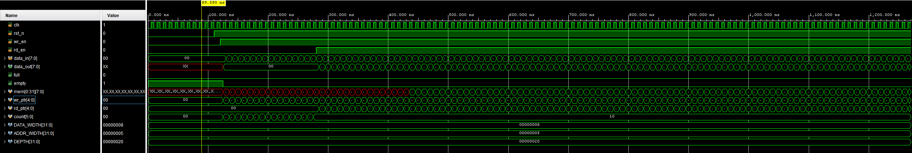
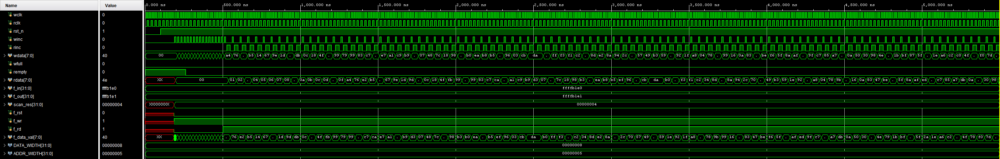

# Hardware FIFO Design

SystemVerilog implementations of synchronous and asynchronous FIFOs with automated verification infrastructure. Designed for FPGA deployment on Xilinx Artix-7.

## Overview

This project implements two FIFO architectures:

| Feature | Sync FIFO | Async FIFO |
|---------|-----------|------------|
| Clock Domains | Single | Dual (CDC) |
| Pointer Encoding | Binary | Gray Code |
| Synchronization | None | 2-FF Synchronizers |
| Use Case | Same-clock buffering | Cross-domain data transfer |


## Project Structure
```
HardwareFifoDesign/
├── rtl/                    # Synthesizable RTL
│   ├── fifo_sync.sv        # Synchronous FIFO
│   └── fifo_async.sv       # Asynchronous FIFO with Gray code CDC
├── tb/                     # Testbenches
│   └── tb_fifo_unified.sv  # Unified testbench for both designs
├── sim/                    # Verification infrastructure
│   ├── run_compare.py      # Main automation script
│   ├── scoreboard.py       # Golden model comparison
│   ├── reporter.py         # Report generation
│   ├── tcl/                # Vivado synthesis scripts
│   └── tests/              # Stimulus generation
├── output/                 # Generated reports
│   ├── reports/
│   └── schematics/
├── docs/                   # Documentation images
└── scripts/                # Utility scripts
```

## Quick Start

### Prerequisites

- Vivado 2025.2 (or compatible)
- Python 3.8+
- matplotlib (`pip install matplotlib`)

### Run Verification
```bash
cd sim

# Full verification suite
python run_compare.py

# With schematic generation
python run_compare.py --schematic

# Single design only
python run_compare.py -d sync
python run_compare.py -d async

# Open waveform viewer
python run_compare.py -d sync --waveform

# Interactive Vivado GUI
python run_compare.py --synth-only --gui
```

### Command Line Options

| Option | Description |
|--------|-------------|
| `--schematic`, `-s` | Generate schematic PDFs |
| `--waveform`, `-w` | Open waveform viewer after simulation |
| `--gui`, `-g` | Open Vivado GUI after synthesis |
| `--design`, `-d` | Select design: `sync`, `async`, or `all` |
| `--sim-only` | Run simulation only |
| `--synth-only` | Run synthesis only |

## Verification Results

Both designs pass functional verification with 100 transactions (write bursts followed by read bursts).

### Resource Utilization (Artix-7 xc7a35t)

| Design | LUT Logic | LUT Memory | Flip-Flops | WNS (ns) | WHS (ns) |
|--------|-----------|------------|------------|----------|----------|
| Sync FIFO | 129 | 0 | 272 | 6.24 | 0.27 |
| Async FIFO | 27 | 8 | 48 | 6.79 | 0.22 |


## Design Details

### Synchronous FIFO

- **Architecture:** Counter-based full/empty decision
- **Output:** First-Word Fall-Through (FWFT)
- **Memory:** Infered as distributed RAM

### Asynchronous FIFO

- **Architecture:** Gray code pointers with 2-FF synchronizers
- **CDC Safety:** Single-bit changes between clock domains
- **Full Detection:** Compare write gray pointer with synchronized read pointer
- **Empty Detection:** Compare read gray pointer with synchronized write pointer

## Waveforms

### Synchronous FIFO

Shows basic FIFO operation with write burst followed by a read burst:



Observations:
- `empty` deasserts after first write
- `data_out` updates combinationally (FWFT)
- Pointers increment on valid transactions

### Asynchronous FIFO

Shows CDC behavior



Observations:
- `wclk` (100MHz) and `rclk` (40MHz) are independent
- gray code pointers only change one bit at a time
- synchronized pointers (`wq2_ptr`, `rq2_wptr`) lag

### Gray Code Conversion
```systemverilog
// Binary 2 Gray
assign gray_next = (bin_next >> 1) ^ bin_next;

// Ex.
// binary 3 (0011) -> gray 3 (0010)
// binary 4 (0100) -> gray 4 (0110)
```

### Full Flag Detection (Gray Code)
```systemverilog
// full when MSB and MSB-1 differ, rest match
assign wfull_val = (wgray_next == {~wq2_rptr[ADDR_WIDTH:ADDR_WIDTH-1],
                                    wq2_rptr[ADDR_WIDTH-2:0]});
```

### 2-FF Synchronizer
```systemverilog
always_ff @(posedge rclk or negedge rrst_n) begin
    if (~rrst_n) {rq2_wptr, rq1_wptr} <= '0;
    else         {rq2_wptr, rq1_wptr} <= {rq1_wptr, wptr};
end
```

