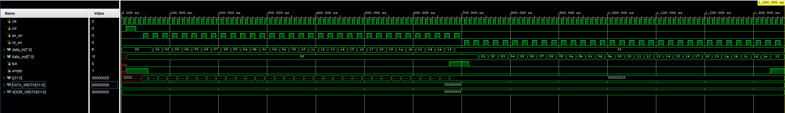

# Synchronous FIFO Design

A parameterizable, synchronous First-In-First-Out (FIFO) memory buffer designed in Verilog. This module safely handles data buffering between a producer and a consumer operating on the same clock domain, featuring robust error detection for overflow and underflow conditions.

## Features
* **Fully Synchronous:** Single clock domain (`clk`).
* **Parameterization:** Easy config. of Data Width and FIFO Depth via parameters.
* **Safety Flags:** Includes standard `full` and `empty` status indicators.
* **Sticky Error Handling:** "Sticky" `overflow` and `underflow` flags that latch High upon error and remain asserted until reset. This ensures that even transient errors are captured and not missed by the controlling logic.
* **Reset Logic:** Asynchronous active-high reset.

## Project Structure
* **`rtl/fifo_sync_top.v`**: The top-level design file containing the control logic, memory array, pointers, and sticky error flag generation.
* **`tb/tb_fifo_sync.v`**: The self-checking testbench that verifies normal operation, boundary conditions, and error injection.
* **`docs/`**: Contains simulation waveforms and verification evidence.

## Interface

| Port Name | Direction | Width | Description |
| :--- | :--- | :--- | :--- |
| `clk` | Input | 1-bit | System Clock. |
| `rst` | Input | 1-bit | Active High Reset. Clears pointers and flags. |
| `wr_en` | Input | 1-bit | Write Enable. Writes `data_in` on rising edge if not full. |
| `rd_en` | Input | 1-bit | Read Enable. Reads to `data_out` on rising edge if not empty. |
| `data_in` | Input | `[DATA_WIDTH-1:0]` | Data input bus. |
| `data_out` | Output | `[DATA_WIDTH-1:0]` | Data output bus. |
| `full` | Output | 1-bit | Asserted when FIFO memory is full. |
| `empty` | Output | 1-bit | Asserted when FIFO memory is empty. |
| `overflow` | Output | 1-bit | **Sticky Flag.** Goes High if a write is attempted while Full. |
| `underflow`| Output | 1-bit | **Sticky Flag.** Goes High if a read is attempted while Empty. |

## ⚙️ Parameters (Default)
* **`DATA_WIDTH`**: `8` (8-bit data)
* **`ADDR_WIDTH`**: `5` (Defines depth as $2^5 = 32$ words)

### Test Cases Verified:
1.  **Normal Operation:** Writing data until Full, then reading until Empty.
2.  **FIFO Full:** Verifies `full` flag assertion at correct depth.
3.  **FIFO Empty:** Verifies `empty` flag assertion when pointers match.
4.  **Sticky Overflow:** Attempting to write to a full FIFO triggers the error flag, which remains High even after the write attempt ends.
5.  **Sticky Underflow:** Attempting to read from an empty FIFO triggers the error flag, which remains High until reset.

## Simulation Results
The following waveform demonstrates the "sticky" behavior of the error flags. Note that `overflow` (triggered at ~600ns) and `underflow` (triggered at ~1350ns) latch High and remain asserted, proving the robust error logic.

## How to Run in Vivado
1.  Add `rtl/fifo_sync_top.v` and `tb/tb_fifo_sync.v` to your project sources.
2.  Set `tb_fifo_sync` as the **Top Module** in Simulation Settings.
3.  Run **Behavioral Simulation**.

## Future Work & Next Steps
* **Synthesis & Timing:** Run Vivado Synthesis to analyze resource utilization (LUT/FF count) and verify timing constraints.
* **Asynchronous Implementation:** Adapt the design to use Gray Code pointers for safe data transfer between different clock domains (CDC).
* **AXI4-Stream Interface:** Wrap the core logic in an AXI wrapper for standard integration with Xilinx IP blocks (Zynq/MicroBlaze).
