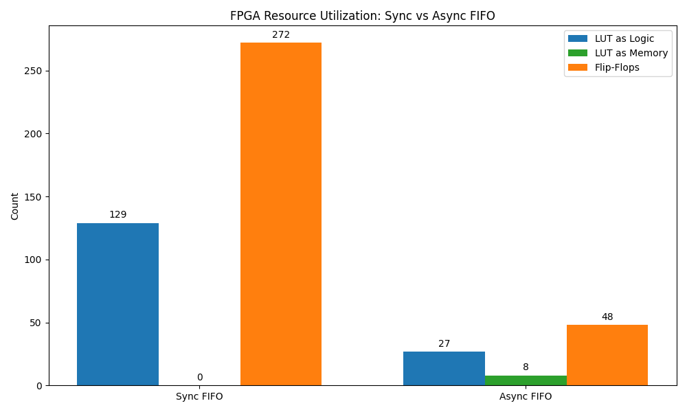

# FIFO Design Comparison Report

## 1. Simulation Status

| Design | Status |
| :--- | :--- |
| Sync FIFO | PASS |
| Async FIFO | PASS |

## 2. Resource Utilization

| Design | LUT Logic | LUT Memory | Flip-Flops | WNS (ns) | WHS (ns) |
| :--- | :---: | :---: | :---: | :---: | :---: |
| Sync FIFO | 129 | 0 | 272 | 6.242 | 0.274 |
| Async FIFO | 27 | 8 | 48 | 6.787 | 0.216 |

## 3. Analysis

### Resource Comparison

- **LUT as Logic**: Combinational logic (pointer math, comparators)
- **LUT as Memory**: Distributed RAM for FIFO storage
- **Flip-Flops**: Sequential elements (pointers, synchronizers)
- **WNS**: Worst Negative Slack (setup timing margin)
- **WHS**: Worst Hold Slack (hold timing margin)
