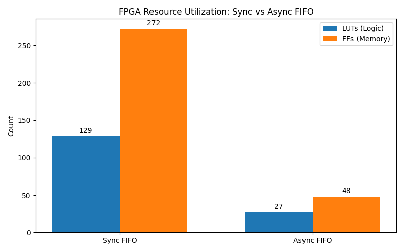

# FIFO Design Comparison Report

## 1. Simulation Status
| Design | Status | Notes |
| :--- | :--- | :--- |
| Sync FIFO | PASS | Pass |
| Async FIFO | PASS | Pass |

## 2. Resource Utilization

| Design | LUTs | Flip-Flops |
| :--- | :--- | :--- |
| Sync FIFO | 129 | 272 |
| Async FIFO | 27 | 48 |

## 3. Schematic Artifacts
The synthesized schematics have been generated as PDFs:
* [Sync FIFO Schematic](schematic_fifo_sync_top.pdf)
* [Async FIFO Schematic](schematic_async_fifo.pdf)
